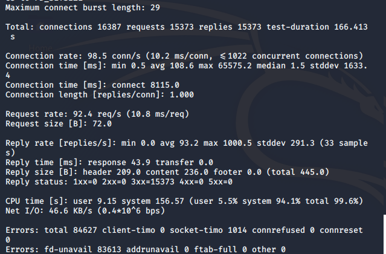
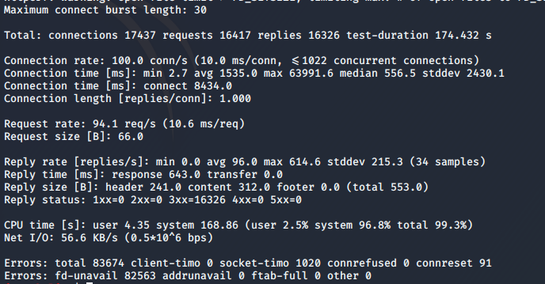

# Load tests 
##Load test 1: Fedora 31 met httperf, monitoring via cockpit
* Commando: `httperf --server=192.168.56.31 --port=80 --uri=/drupal --rate=150 --num-conns=27000`
* 
* Fedora maakt 98.5 connecties per seconde, en de gemiddelde tijd hiervoor nodig is 108.6 ms.
* 1014 connecties werden gewijgerd door timeout
## Load test2: Centos 7 - docker met httperf, monitoring via cockpit
* Commando: `httperf --server=192.168.56.31 --port=8080 --uri=/ --rate=150 --num-conns=27000`
* 
* docker maakt 100 connecties per seconde, deed hier gemiddeld veel langer over (1535 ms)
* 1020 connecties werden geweigerd door een timeout & 91 werden gereset
