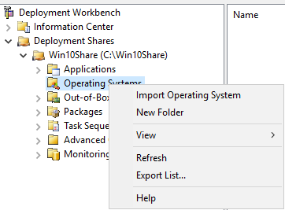
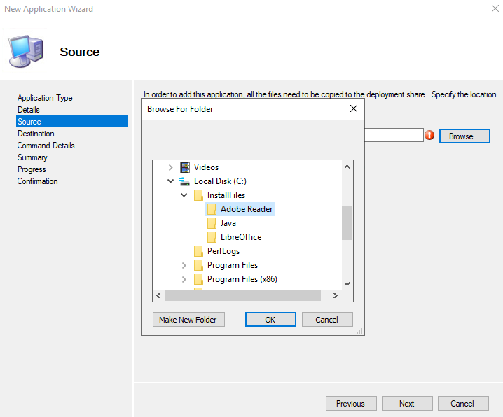
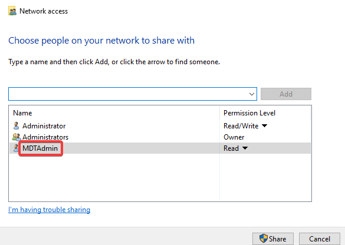
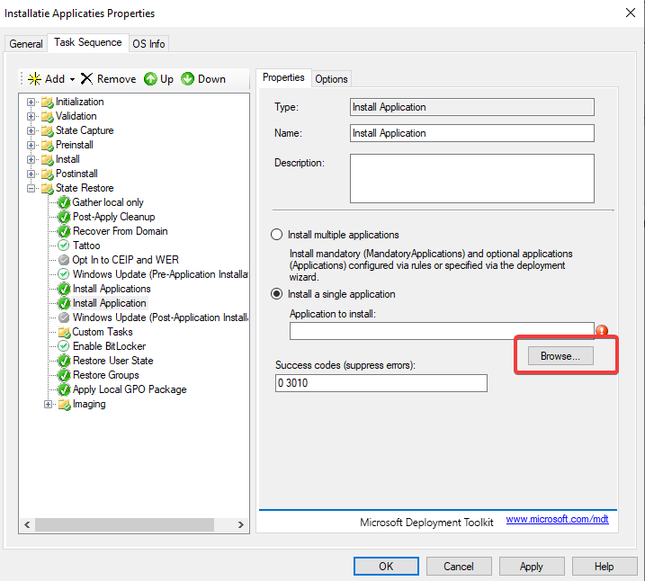

# Technische documentatie gebruik MDT
### Download de volgende bestanden:
- [Windows ADK](https://go.microsoft.com/fwlink/?linkid=2086042)
- [Windows PE For ADK](https://go.microsoft.com/fwlink/?linkid=2087112)
- [Microsoft Deployment Toolkit](https://www.microsoft.com/en-us/download/details.aspx?id=54259)
- [Acrobat Reader DC Enterprise](https://get.adobe.com/reader/enterprise/)
- [7zip](https://www.7-zip.org/a/7z1900-x64.exe)
- [Java](https://www.java.com/nl/download/manual.jsp)
- [LibreOffice](https://nl.libreoffice.org/download/libreoffice-fris/)
- [Windows 10 ISO](https://www.microsoft.com/en-us/evalcenter/evaluate-windows-10-enterprise)
- [Windows Server 2016 ISO](https://www.microsoft.com/en-us/evalcenter/evaluate-windows-server-2016)

Alle stappen in dit document staan in volgorde, volg deze volgorde en alles zou moeten werken.

## Installatie
**1. Microsoft ADK**
* Run de windows ADK installer


* Run de Windows PE addon


    * Afhankelijk van uw internetverbinding kan dit enige tijd duren. U kunt al naar de volgende stap gaan.\
\
\
**2. Microsoft Deployment Toolkit**


**3. Installatie Rollen**
* Installeer al deze rollen

* Verander nu ook de naam van de host al zodat alles iets leesbaarder is


* Herstart de PC nu zodat de naam van de server veranderd is.


* De server zal nu opnieuw opstarten, het resultaat zal zijn dat uw server Domain Controller is.

**4. Adapters toevoegen (Virtualbox only)**
* Dit is ook een goed moment om Guest additions te installeren moest je het nodig hebben voor bijvoorbeeld shared folders of clipboard

* Configureer de tweede adapter als


**5. Aanmaken Deployment Share**
* het is belangrijk dat u nu al de benodigde bestanden op de vm hebt staan, inclusief de ISO's.
* Open MDT Workbench ("Deployment Workbench)


* Hierna kan je gewoon op next drukken tot de share aangemaakt is.
* Mount je ISO

* Importeer je OS

* Kies "Full set of source files"
* Browse naar de Drive letter waarop de ISO gemount is

* Je kan nu eventueel de naam etc nog aanpassen, dit maakt enkel een visueel verschil
* Druk op next en wacht tot het OS geïmporteerd is. Dit kan even duren. Je kan eventueel nu al de applicaties uitpakken en klaar zetten in de juiste folders. (Zie volgende stap)

* Herhaal deze stappen voor Windows Server 2016

**6. Configureer Applications**
* Steek al de installatiefiles in een aparte folder

* Pak Acrobat Reader uit 

* Pak LibreOffice uit indien nodig
* Maak een nieuwe folder aan onder "Applications" in de Deployment Share die we eerder aangemaakt hebben.

* Voeg een nieuwe app toe

* Kies "Application with source files" en klik op next
* Geef een toepasselijke naam in, in dit geval bijvoorbeeld Adobe Reader en klik op next
* Browse naar de folder waar je de applicatie opgeslagen hebt en selecteer deze.

* Voer dit commando in: "msiexec /i AcroRead.msi /qn"

* Klik op next tot de applicatie toegevoegd is.
* herhaal deze stappen voor Java en Libreoffice.
* In te voeren commando Java: "java.exe /s"
* in te voeren commando LibreOffice: "msiexec /i LibreOffice.msi  /qn"

**7. Windows Server 2016:**
* Download SQL Server install tool en voer het uit
* Kies download

* Installeer het naar je InstallFiles en kies .cab

* Dit kan enige tijd duren
* Ga naar de directory waar je de files gedownload hebt 
* Dubbelklik de .exe file, deze zal nu alles uitpakken. Doe dit in een subfolder

* [Download deze file en plaats hem in de nieuwe subfolder](https://github.com/HoGentTIN/p2ops-1920-a03/blob/master/opdracht04/ConfigurationFile.ini)
* Importeer nu de applicatie in MDT Workbench

* Naam SQL
* Selecteer de Subfolder van SQL

* Command line: `SETUP.exe /ConfigurationFile="ConfigurationFile.ini"`
* Rond de applicatieinstallatie af


**8. Deployment Share properties**
* Rechterklik op de share en ga naar properties.
* Klik x86 weg
* 
* ga naar rules
* Voeg deze rules toe:
```
[Settings]
Priority=Default
Properties=MyCustomProperty

[Default]
OSInstall=Y
SkipCapture=YES
SkipAdminPassword=YES
SkipProductKey=YES
SkipComputerBackup=YES
SkipBitLocker=YES
SkipComputerName=YES
SkipDomain Membership=YES
SkipUserData=YES
SkipLocaleSelection=Yes
SkipTimeZone=Yes
SkipSummary=Yes
SkipBDDWelcome=YES
TaskSequenceID=EnterpriseTest
SkipTaskSequence=YES
SkipDomainMembership=YES
SkipApplications=YES
DoCapture=NO
WSUSServer=http://192.168.111.111:8530
```
* 
* klik op "edit boodstrap.ini"
* Plak dit:
```
[Settings]
Priority=Default

[Default]
DeployRoot=\\MDT-HOST\Win10Share
USERID=**UW USER DIE U AANGEMAAKT HEBT VOOR DE SHARE**
UserDomain=MDTD.local
UserPassword=**UW WACHTWOORD**
KeyboardLocale=nl-BE
SkipBDDWelcome=YES
```
* 

* Herhaal deze stappen nu voor Windows Server 2016 met als rules :
```
[Settings]
Priority=Default
Properties=MyCustomProperty

[Default]
OSInstall=Y
SkipCapture=YES
SkipAdminPassword=YES
SkipProductKey=YES
SkipComputerBackup=YES
SkipBitLocker=YES
SkipComputerName=YES
SkipDomain Membership=YES
SkipUserData=YES
DoCapture=NO
SkipLocaleSelection=Yes
SkipSummary=Yes
SkipTimeZone=Yes
SkipApplications=YES
SkipBDDWelcome=YES
TaskSequenceID=1
SkipTaskSequence=YES
SkipRoles=YES
SkipDomainMembership=YES
WSUSServer=http://192.168.111.111:8530
```
en
```
[Settings]
Priority=Default

[Default]
DeployRoot=\\MDT-HOST\WinServer2016
USERID=test
UserDomain=MDTD.local
UserPassword=Project2020
KeyboardLocale=nl-BE
SkipBDDWelcome=YES
```
* Ga nu naar Server Management Console
- 
- 
- 
- 
* Ga nu naar de deployment share in C:/
* Rechterklik de folder en ga naar properties
- 
* Type de naam van de user die je net aangemaakt hebt in en klik Add, dan Share en apply.
- 

**9. Task sequence**
* Rechterklik Task Sequence en maak een nieuwe task sequence aan
#### !!! BELANGRIJK: De task sequence ID moet dezelfde zijn als die opgegeven in de rules eerder!!!
* Voer een task sequence ID en naam in:
* 
* Kies voor Standard Client Task Sequence
* Selecteer je geïmporteerde OS
* 
* Kies "do not specify a product key at this time"
* Geef gegevens voor een user en een organisatie
* Geef een paswoord voor de administrator
* Klik op next tot de task sequence aangemaakt is
* Rechterklik op de nieuwe task sequence en klik op properties
* Om updates in te schakelen: 
* 
* Voeg de te installeren applicaties toe:
* 
* 
* 
* Herhaal dit voor al de te installeren applicaties.
* Klik op apply
* Rechterklik nu op de deployment share en selecteer "update deployment share"
* 
* Afhankelijk van de kracht en schrijfsnelheid van uw Server kan dit enige tijd duren.

* Voor Windows Server 2016:
* 
* Kies Standard Server Task Sequence
* Selecteer de gewenste OS.
* Vul user en organisatie in
* Geef het lokale Admin-paswoord
* Enable updates in de task sequence
* 
* Selecteer SQL Server hier
* 
* Voeg een task voor roles & features toe
* 
* Selecteer Windows Server 2016 als operating system
* Selecteer "Web Server (IIS) en ASP.NET 3.5 of 4.6 zoals gewenst
* klik Apply

**10. WSUS installeren**
* installeer Windows Server Update Services op de server onder roles (helemaal onderaan)
* Maak een folder genaamd "WSUS" aan in de C Drive
* als remote path bij de installatie van WSUS geef "C:\WSUS" in
* Druk op next tot de installatie gedaan is, klik dan op "Launch post-installation tasks", en wacht tot dit gedaan is
* Open Windows Server update services onder tools, en run de configuratie
* Selecteer Engels & Nederlands
* Selecteer de nodige versies van windows; Windows 10 en Server 2016, evt Edge 
* Selecteer alles bij classifications
* Zet de synchronizatie op een handig moment (bijvoorbeeld 's nachts), next
* Begin de initiele configuratie
* klik op finish
* Nadat al de updates gesynchronizeerd zijn, authoriseer de updates

**11. Windows Deployment Services configureren**
### Configureer DHCP
* Werk de installatie van DHCP af, klik gewoon telkens op next, commit of finish
* Ga naar DHCP via tools op het server management scherm
* Rechterklik de IPv4 tab en klik op "New Scope"
* Geef een gepaste naam in, bijv "MDTSCOPE"
* 
* Start IP: 192.168.111.31
* End IP: 192.168.111.130
* Length: 24
* Subnet Mask: 255.255.255.0
* Klik op next tot je aan "Lease Duration" komt
* Geef hier een toepasselijke lengte voor de lease in.
* Configureer deze opties
* Kies telkens het IP van deze server (192.168.111.111)
* Ga naar Scope Options en rechterklik Configure
* Selecteer deze opties:
* 
* Open powershell en voer volgende commandos uit:
    - netsh
    - dhcp server
    - add optiondef 60 PXEClient STRING 0 comment=”Option added for PXE support”
    - set optionvalue 60 STRING PXEClient
    - exit
 * Activeer de scope en herstart de DHCP-Server indien nodig

* 
* Rechterklik de server en klik op configure
* Kies integrated with Active Directory
* Klik op next tot je aan de PXE Server Initial Settings komt en kies "Respond to all client computers"
* Klik finish
* Het kan eventueel gebeuren dat je de Server nog manueel moet starten. rechterklik -> all tasks -> start
* Ga naar boot images en voeg de .wim file die daarnet gemaakt is toe. Deze kan je vinden onder de deployment share en dan de boot folder
* 
* Geef een toepasselijke naam en beschrijving
* 
* Rechterklik de server nu en ga naar properties
* Kies deze opties
* 
* Onder de "TFTP" tab vink je de "Enable Variable Window Extension" af
* Klik op Apply
