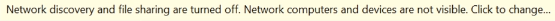

# Stappenplan opstellen VM's

## Benodigde downloads

* 64-bit kali linux: https://www.offensive-security.com/kali-linux-vm-vmware-virtualbox-image-download/
* Vmware workstation pro: https://www.vmware.com/products/workstation-pro/workstation-pro-evaluation.html
* Windows 10 entreprise edition iso: https://www.microsoft.com/en-us/evalcenter/evaluate-windows-10-enterprise
* Windows server 2016 iso: https://www.microsoft.com/en-us/evalcenter/evaluate-windows-server-2016

## Kali Linux virtual machine opstellen

1. Ga naar de homepagina van VMware workstation pro.
2. Klik op "Open een vritual machine".
3. Selecteer de .iso-file van de Kali Linux machine.
4. Selecteer de virutele machine en klik op "edit virtual machine settings".
5. Geef de VM 1/8 van je ram geheugen.
6. Zet de netwerkadapter op NAT i.p.v. bridged.
7. Optioneel: je kan ook het aantal processoren aanpassen om de VM sneller te laten werken.
8. Nu kan je de VM opstarten door op "Power on this virtual machine" te klikken.
9. Bij het opstarten van de VM zal er een boodschap verschijnen, selecteer hier de optie: "i copied it".
10. Meld je aan met username: "Kali" en wachtwoord "Kali". (Voor standaard aan te melden als root zie "Mogelijke problemen")
11. Geef volgend commando in in de terminal: `apt install python-pip`, bevestig met y, en in het scherm dat vervolgens tevoorschijn komt selecteer yes.
12. Download van github impacket versie 0.9.19 (zie downloads). Pak deze pak uit in de opt folder, ga daarnaar naar de impacket map. Om de installatie van impacket te runnen geef vervolgens `pip install .` in in de terminal (je moet in /opt/impacket zitten om dit commando te kunnen uitvoeren).

## 2 keer Windows 10 enterprise virtual machine opstellen

1. Ga naar de homepagina van VMware workstation pro.
2. Klik op "creëer een nieuwe vritual machine".
3. Selecteer de .iso-file van Windows 10 en klik op next.
4. Selecteer onder "Version of Windows to install" Windows 10 Enterprise en klik op next en in de popup klik je op yes.
5. Kies de locatie waar je je virtual machine wilt plaatsen.
6. Geef de VM een Maximum disk size van 60 GB en vink "Split virtual disk into multiple files" aan.
7. Vink "Power on this virtual machine after creation" uit.
8. Selecteer de virutele machine en klik op "edit virtual machine settings".
9. Selecteer de floppy disk en klik onderaan op "Remove".
10. Zorg dat de netwerkadapter op NAT staat.
11. Optioneel: Je kan hier ook je aantal processoren en ram-geheugen aanpassen voor betere prestaties.
12. Nu kan je de VM opstarten door op "Power on this virtual machine" te klikken.
13. De VM zal vragen om eender welke toets in te drukken. Indien je niet op tijd een toets ingedrukt hebt, sluit de VM af en probeer opnieuw.
14. Selecteer de juiste taal en toetsenbordindeling en klik op "next" en vervolgens op "install now".
15. Accepteer de license terms en druk op next.
16. Kies voor een custom install.
17. In het volgende venster, klik op "New">"Apply">"Ok">"Next".
18. Selecteer de juiste regio en toetsenbordindeling.
19. Kies links onderaan voor "Domain join instead".
20. Geef een gebruikersnaam in en kies een makkelijk wachtwoord (vb. Password1).
21. Voer de security questions zoals je wil (antwoorden maken niet uit)> "No"> "Decline"> vink alles uit> "Accept".
22. Optioneel: installeer VMware Tools (Player> Manage> Install VMware Tools> Install> open File explorer> dvd VMware Tools> Voer setup64.exe uit> next> complete> next> Finish> no)
23. In de seach balk zoek "view your pc name", selecteer "rename this pc", geef je computer een naam en herstart de computer.

## Windows Server 2016 virtual machine opstellen

1. Ga naar de homepagina van VMware workstation pro.
2. Klik op "creëer een nieuwe vritual machine".
3. Selecteer de .iso-file van Windows Server 2016 en klik op next.
4. Selecteer onder "Version of Windows to install" Windows Server 2016 Standard en klik op next en in de popup klik je op yes.
5. Kies de locatie waar je je virtual machine wilt plaatsen.
6. Geef de VM een Maximum disk size van 60 GB en vink "Split virtual disk into multiple files" aan.
7. Vink "Power on this virtual machine after creation" uit.
8. Selecteer de virutele machine en klik op "edit virtual machine settings".
9. Selecteer de floppy disk en klik onderaan op "Remove".
10. Zorg dat de netwerkadapter op NAT staat.
11. Optioneel: Je kan hier ook je aantal processoren en ram-geheugen aanpassen voor betere prestaties.
12. Nu kan je de VM opstarten door op "Power on this virtual machine" te klikken.
13. De VM zal vragen om eender welke toets in te drukken. Indien je niet op tijd een toets ingedrukt hebt, sluit de VM af en probeer opnieuw.
14. Selecteer de juiste taal en toetsenbordindeling en klik op "next" en vervolgens op "install now".
15. Selecteer Windows Server 2019 Standard Evaluation (Desktop Experience) en druk dan op next.
16. Accepteer de license terms en druk op next.
17. Kies voor een custom install.
18. In het volgende venster, klik op "New">"Apply">"Ok">"Next".
19. De VM zal nu herstarten en je een wachtwoord laten kiezen voor de administrator. Kies een wachtwoord met tekens letters en nummers van minstens 8 tekens lang zonder volledige woorden (vb. P@$$w0rd!).
20. Als de VM opgestart is zal je ctrl+alt+delete moeten invoeren via deze knop: 
21. Meld je nu aan als administrator met het wachtwoord dat je hieraan hebt toegekend.
22. Optioneel: installeer VMware Tools (Player> Manage> Install VMware Tools> Install> open File explorer> dvd VMware Tools> Voer setup64.exe uit> next> complete> next> Finish> no)
23. In de seach balk zoek "view your pc name", selecteer "rename this pc", geef je computer een naam en herstart de computer.
24. Meld aan als Administrator.
25. In Server Manager klik rechts bovenaan op "Manage"> "Add roles and features"> "Next"> "Next> "Next"> Add de "Active Directory Domain Services" feature> "Next"> "Next"> "Next"> "Install"
26. Als de installatie van de feature klaar is zal er links van "Manage" een notificatie zijn. Klik op 'Promote a server to a domain controller"> vink "Add a new forest" aan en voer een naam met achter de naam `.local` in in het veld "Root domain name"> "Next"> Voer een wachtwoord in> "Next"> "Next"> "Next"> "Next"> "Next"> "Install".
27. Meld aan als Administrator> "Server Manager"> "Active Directory Users and Computers"> Klik op het domein> "Users"
28. Maak een nieuw gebruiker aan in het domein: rechtermuisklik> "New"> "User"> Vul een voornaam, achternaam en een login naam in> "Next"> voer een makkelijk wachtwoord in (vb. Password1)> vink "Password never expires" aan> "Next"
29. Kopieer de Adinistrator en maak hier ook een nieuwe gebruiker van zoals in de vorige stap maar met een moeilijker wachtwoord.
30. "Server Manager"> "File and Storage Services"> "Shares"> "TASKS"> "New share"> "Next"> "Next"> Geef de share een naam (vb. hackme)> "Next"> "Next"> "Next"> "Create"
31. Geef in de zoekbalk "Group Policy Management" in> rechtermuisklik op het domein> "Create a GPO..."> Noem deze GPO "Disable Windows Defender"> "Ok"
32. Klik In het"Group Policy Management" venster het domein open> rechtermuisklik op "Disable Windows Defender"> "Edit"> "Computer Configuration"> "Policies"> "Administrative Templates"> "Windows Components"> "Windows Defender Antivirus"> "Turn off Windows Defender Antivirus"> "Enabled"> "Apply"> "Ok"

## 2 keer Windows 10 computer toevoegen aan het domein

1. "File explorer"> "This pc"> "C-schijf"> Maak een nieuwe map genaamd share> "propterties" op deze map> "Sharing"> "Share"> "Share"> "Yes, turn on network discovery and filesharing for all public networks"> "Done"
2. Onderaan rechts op internet symbool rechtermuisklik> "Open internet en network settings"> "Change adapter options"> rechtermuisklik op Ethernet0 en klik op properties> dubbelklik op "Internet Protocol Version 4 (TCP/IPv4)"> "Use the following DNS server address"> geef hier het ip address in van de server (ipconfig in cmd op server)> "Ok"
3. Geef "Access work or school" in in de zoekbalk op het bureaublad> "Connect"> "Join this device to a local Active Directory domain"> Voer de domeinnaam.local in> geef de logingegevens van de administrator van het domein in> "Skip"> "Restart now"
4. Als de VM terug opgestart is meld je je aan als een andere gebruiker en geef je de logingegevens van de gebruiker op het domein in (indien de domeinnaam niet geselecteerd wordt, ga dan de gebruikersnaam vooraf met "domeinnaam\").
5. Log uit> meld je aan als administrator op het domein> geef "Computer management" in in de zoekbalk op het bureaublad> "Local Users and Groups"> "Groups"> dubbelklik "Administrators"> "Add..."> typ de loginnaam van de gebruiker op het domein in het tekstvak "Enter the object names to select" (bij de 2de computer moeten beide gebruikers hier ingevoerd worden)> "Check Names"> "Apply"> "Ok"
6. "File explorer"> "Network"> "Ok"> klik op > "Turn on network discovery and file sharing"

## Mogelijke problemen

Geen internet:
* Kijk of vmware de laatste nieuwe versie heeft
* Zorg dat de netwerk adapter op NAT en aangesloten staat

Wachtwoord rootgebruiker onbekend:
* Log in met login 'Kali' en wachtwoord 'Kali' (Let op standaards querty dus a=q)
* Open terminal
* `Sudo su root`
* `Kali`
* `Passwd`
* Geef een nieuw wachtwoord in (volgende keer kan je aanmelden met login root en het wachtwoord dat je ingegeven hebt.

Toetsenbord niet in azerty:
* Windows toets > keyboard > layout > vink "use system defaults" uit
* Voeg toetsenbord French alt toe en verwijder ander toetsenbordlayouts (French alt was mijn toetsenbordlayout, kan anders zijn voor jullie)

Cmd 'Install pip .' Werkt niet:
* `apt-get install python-pip`
* `Install pip .`

Als je een commando niet kan uitvoeren (voorbeeld hierboven):
* Kijk welke packages dit commando moet hebben om uitgevoerd kunnen te worden
* `Apt install "naam package"` (bijvoorbeeld git)
