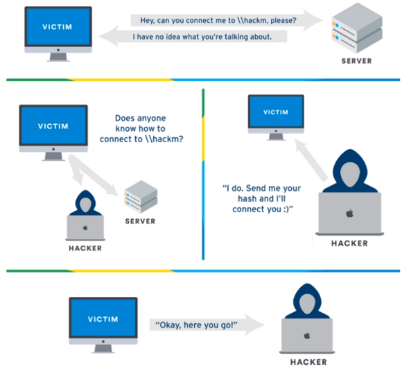

# Cyberattacks

## LLMNR

Link Local Multicast Name Resolution

* Nut: Indetificeert hosts als DNS hierin faalt.
* Zwakke plek: Als je op deze service reageert dan antwoordt deze service met een username en een wachtwoord hash.

### Situatie

### Voorbereiding

* Impacket v0.9.19 moet geïnstalleerd zijn op de Kali Linux machine.
* Hashcat moet gedownload zijn (liefst op je locale machine).
* Rockyou.txt moet ter beschikking zijn op dezelfde machine en in dezelfde map als waar je Hashcat hebt gedownload.

### Uitvoering

1. Op de Kali Linux machine runnen we Responder met het commando `responder -I eth0 -rdwv`
2. Nu is de Responder aan het kijken of er LLMNR- of NBT-NS broadcasts over het netwerk lopen.
3. Er is een gebeurtenis van Computer 1, de gebruiker die momenteel op Computer 1 probeerde een share te bereiken maar heeft een verkeerde naam ingegeven.
4. Op de log van de responder is nu een Hash te zien van deze gebruiker. De gebruikersnaam komen we hierdoor al te weten want in deze hash staat die gebruikersnaam letterlijk in de hash.
5. Kopieër de hash en zet deze in een .txt bestand in de Hashcat map.
6. Dan open je cmd en voer je het commando `hashcat64.exe -m 5600 Hash.txt rockyou.txt -O` uit.
7. Als resultaat zul je nu de hash terugkrijgen met ook het wachtwoord in plain text.

### Bescherming

#### Uitschakelen van LLMNR

1. Open Group Policy Editor.
2. Ga naar Local Computer Policy > Computer Configuration > Administrative Templates > Network > DNS Client.
3. Zorg dat onder DNS Client "Turn OFF Mulitcast Name Resolution" op Enabled staat.

#### UItschakelen van NBT-NS

1. Open uw netwerkverbindingen en open de property's van uw netwerkadapter.
2. Open de IPv4 properties.
3. Open de Advanced tab, vervolgens de WINS tab en vink dan "Disable NetBIOS over TCP/IP" aan.
