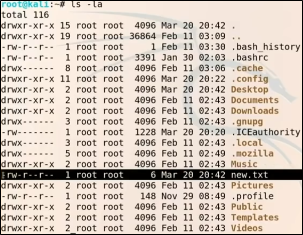

# Documentatie

## 5 Stage of hacking

* Reconnaissance
    * Information gathering
        * Passive (informatie opzoeken zonder in te breken (bijvoorbeeld: linkedin informatie bekijken,…)
            * Location information (satelietafbeeldingen, grondplan,…)
            * Job information (werknemers, afbeeldingen)
            1. Target validation (deze tools dienen om te controleren of je target wel eigendom is van diegene die je wilt aanvallen)
                * WHOIS, nslookup, dnsrecon
            2. Finding subdomains (meer informatie vinden over de site)
                * Google Fu, dig, Nmap, Sublist3r, Bluto, crt.sh
            3. Fingerprinting (welke tools of backend wordt er gebruikt)
                * Nmap, Wappalyzer, WhatWeb, BuiltWith, Netcat
            4. Data breaches
                * HavelBeenPwned
        * Active
* Scanning and enumeration (belangrijk!)
* Gaining access
* Maintaining access
* Covering tracks

## Basic linux commando's voor pentesting

### Algemene commando's voor te nagigeren in de verkenner

| Commando|Wat doet dit commando|
| -------------   |-------------|
| pwd | Toont het pad naar de map waar je momenteel in zit |
| ls | Toont wat er in de map zit waar je momenteel in zit |
| ls -la | Toont wat er in de map zit waar je momenteel in zit inclusief verborgen bestanden en mappen en toont de rechten van de gebruikers (zie gebruikerscommando's|
| ls "pad naar een map" | Toont wat er in de map zit waarnaar je verwijst |
| cat "bestandsnaam" | Toont wat er in het bestand zit. |
| cd.. | Ga naar de bovenliggende map |
| cd "pad naar een map" | Gaat naar de map die meegegeven is |
| cd - | Ga naar de vorige directory |
| mkdir "naam" | Maak een map met de meegegeven naam |
| mv "bestandsnaam" "pad naar een map" | Verplaatst het meegegeven bestand naar de meegegeven locatie |
| rm "pad naar een bestand" | Verwijdert een bestand |
| cp "bestandsnaam" "pad naar een map" | Kopieert het meegegeven bestand naar de meegegeven locatie |
| locate "invoerstring" | Toont alle bestanden waar de invoerstring in de naam in voorkomt |
| updatedb | Zorgt ervoor dat de database waarin gezocht wordt bij het commando `locate` geupdate wordt. |
| passwd "gebruikersnaam" | Verandert het wachtwoord voor de meegegeven gebruiker |
| man "commando" | Toont de handleiding voor het meegegeven commando |

### Gebruikerscommando's

| Commando|Wat doet dit commando|
| -------------   |-------------|
| chmod 777 "bestandsnaam" | Geeft alle rechten aan alle gebruikers (hyperlink naar chmod uitleg). |
| chmod +x "bestandsnaam" | Geeft executerechten aan alle gebruikers (hyperlink naar chmod uitleg). |
| adduser "username" | Voegt een gebruiker toe. |
| cat /etc/passwd | Toont alle gebruikers van de machine. |
| cat /etc/shadow/ | Toont de hashes van alle gebruikers op de machine. |
| su "gebruikersnaam" | Verandert van account naar het account van de meegegeven gebruiker. |



* Eerste teken: D = map, - = bestand
* Voor de volgende tekens geldt steedt dezelfde regel: R = Read rechten, W = Write rechten, E = Execute rechten
* Teken 2-4: bestands- of mapeigenaar rechten
* Teken 5-7: groupsrechten
* Teken 8-10: alle andere rechten

### Netwerkcommando's

| Commando|Wat doet dit commando|
| -------------   |-------------|
| ifconfig | Toont alle fysieke netwerkadapters en hun instellingen. |
| iwconfig | Toont alle wireless netwerkadapters en hun instellingen. |
| ping "ip address" | Pingt het meegegeven ip address. |
| arp -a | Geeft voor alle ip addressen die gekent zijn het overeenkomstige mac address. |
| netstat -ano | Toont je de actieve connecties/poorten die runnen op je systeem. |
| route | Toont de routing table. |

### Tekstbestanden bewerken

| Commando|Wat doet dit commando|
| -------------   |-------------|
| echo "tekst" > "bestandnaam" | Overschrijft de tekst in het meegeleverde bestand en schrijft in de plaats de meegeleverde tekst. Indien het meegeleverde bestand niet bestaat wordt dit bestand aangemaakt. |
| echo "tekst" >> "bestandsnaam" | In plaats van de bestaande tekst te overschijven voegt die commando tekst onderaan toe. |
| touch "bestandsnaam" | Maakt een nieuw bestand aan met als naam de meegeleverde bestandsnaam. |
| nano/vi/vim "bestandsnaam" | Nano vi en vim zijn teksteditors in de linux terminal en zorgen ervoor dat er een gui is waarin je de tekst kan aanpassen. |
| gedit "bestandsnaam" | Gedit is een GUI om tekstbestanden aan te passen. De textfile opent dan in een nieuw tabblad. |

### Starten en stoppen van services

| Commando|Wat doet dit commando|
| -------------   |-------------|
| service apache2 start/stop | Start of stopt een tijdelijke webserver op. De standaard webpagina toont waar je de .html file kunt vinden om deze pagina aan te passen. |
| pyhton -m SimpleHTTPServer "poortnummer" | Start een tijdelijke webserver op op het meegeleverde poortnummer. Dit toont de inhoud van de map waarin dit commando uitgevoerd is. |
| systemctl enable/disable "service" | Start een service op bij de opstart van het systeem. |

### Installeren en updaten van tools

| Commando|Wat doet dit commando|
| -------------   |-------------|
| apt update && apt upgrade | Installeert en upgrade basis packages. |
| apt install "package" | Installeert een specifieke package. |
| git clone "clone link github" | Cloned de github repository en installeert deze package. |

## Slecht script voor het scannen van openstaande poorten

* Uitvoeren: /ipsweep.sh "eerste 3 bytes van IP-address"
```
import subprocess #files
import datetime 
import re
import argparse #arguments bijvoorbeeld: --help

def write_result(filename, ping):
	with open(filename, "W") as f:
		f.write(f"Start time {datetime.datetime.now()}")
		for result in ping:
			f.write(result)
		f.write(f"End time {datetime.datetime.now()}")

def ping_subnet(subnet):
	for addr in range(1,255):
		yield subprocess.Popen(["ping", f"{subnet}.{addr}", "-n", "1"], stdout=subprocess.PIPE) \  .stdout.read() \ .decode()
		
def main(subnet, filename):
	write_result(filename, ping_subnet(subnet))

def parse_arguments():
	parser = argparse.ArgumentParser(usage='%(prog)s [options] <subnet>', description ='ipchecker', epilog="python ipscanner.py 192.168.1 -f somefile.txt"
	parser.add_argument('subnet', type=str, help='the subnet you want to ping')
	parser.add_argument('-f', '--filename', typer=str, help='The filename')
	args = parser.parse_args()
	
	if not re.match(r"(\d{1,3}\.\d{1,3}\.\d{1,3})", args.subnet) \
	or any(a not in range(1,255) for a in map(int, args.subnet.split("."))):
		parse.error("This is not a valid subnet")
		
	if " " in args.filename:
		parser.error("There cannot be whitespaces in the filename")
	
	return args.subnet, args.filename
	
if __name__ == '__main__':
main(*parse_arguments())
```

### Nieuwe commando's in dit script

| grep "string" | Neemt van een grote blok tekst enkel de lijnen die de meegegeven string bevatten. |
| cut -d " " -f 4 | Splitst 1 string op in de delen van de string die gescheiden zijn door een spatie en geeft dan de 4de string weer. |
| tr -d ":" | verwijdert alle : uit de string |

## Python scripts

### Python script 1 voor basis scripten

```
#1/bin/python3

#Print string
print("Strings and things:")
print('Hello world_')
print("""Hello, this is
a multi line string""")
print("this is"+"a string")

print("\n") #new line

#Maths
print("Math time:")
print(50 + 50) #optellen
print(50 - 50) #aftrekken
print(50 * 50) #vermeerderen
print(50 / 50) #delen
print(50 ** 50) #exponenten
print(50 % 50) #modulo
print(50 // 50) #deling zonder rest

print("\n") #new line

#variables & Methods
print("Fun with variables and methods:")
quote = "All is fair in love and war"
print(len(quote)) #length
print(quote.upper()) #uppercase
print(quote.lower()) #lowercase
print(quote.title()) #title

name = "Heath"
age = 29 #int int(29)
gpa = 3.7 #float float(3.7)

print(int(age)) #uitvoer: 29
print(int(29.9)) #uitvoer: 29

print("My name is " + name + " and i am " + str(age) + " years old") #je kan geen int in een string concatten


print("\n") #new line

age += 1
print(age)

birthday = 1
age += birthday
print(age)

print("\n") #new line

#Functions
print("Now, some functions:")
def who_am_i():
	name = "Health"
	age = 29
	print("My name is " + name + " and i am " + str(age) + " years old")
	
who_am_i()

#adding in parameters
def add_one_hundred(num):
	print(num + 100)
	
add_one_hundred(100)

#add in multiple parameters
def add(x,y):
	print(x + y)
	
add(7,7)
add(305,207)

#Using return
def multiply(x,y):
	return x * y
	
print(multiply(7,7))

def square_root(x):
	return x ** .5
	
print(square_root(64))

print("\n") #new line

#Boolean expressions (True or False)
print("Boolean expressions:")
bool1 = True
bool2 = 3 * 3 == 9
bool3 = False
bool4 = 3*3 != 9
print(bool1,bool2,bool3,bool4)
print(type(bool1))

bool5 = "True"
print(type(bool5))

#Relational and Boolean Operators
greater_than = 7 > 5
less_than = 5 < 7
greater_than_equal_to = 7 >= 7
less_then_equal_to = 7<= 7

print(greater_than, less_than, greater_than_equal_to, less_then_equal_to)

test_and = (7 > 5) and (5 < 7)
test_or = (7 > 5) or (5 < 7)
test_not = not True

print(test_and)

print("\n") #new line

#Conditional Statements
print("Conditional Statements:")
def soda(money):
	if money >= 2:
		return "You've got yourself a soda!"
	else:
		return "No soda for you!"

print(soda(3))
print(soda(1))

def alcohol(age, money):
	if (age >= 21) and (money >= 5):
		return "We're getting tipsy!"
	elif (age >= 21) and (money < 5):
		return "Come back with more money."
	elif (age < 21) and (money >= 5):
		return "Nice try, kid."
	else:
		return "You're too poor and too young"
		
print(alcohol(21,5))
print(alcohol(21,4))
print(alcohol(20,5))
print(alcohol(20,4))

print("\n") #new line

#Lists
print("Lists have brackets:")
movies = ["When Harry Mey Sally", "The Hangover", "The Perks of being a Wallflower", "The Exorcist"]

print(movies[0])
print(movies[0:3])
print(movies[1:])
print(movies[:1])
print(movies[-1])
print(len(movies))

movies.append("JAWS")
print(movies)

movies.pop()
print(movies)

movies.pop(1)
print(movies)

movies = ["When Harry Mey Sally", "The Hangover", "The Perks of being a Wallflower", "The Exorcist"]
person = ["Heath", "Jake", "Leah", "Jeff"]
combined = zip(movies, person)
print(list(combined))

#Tuples
print("Tuples have parentheses and cannot change")
grades = ("A", "B", "C", "D", "F")
print(grades[1])

#Looping
print("For loops - start to finish of iterate:")
vegetables = ["cucumber", "spinach", "cabbage"]
for x in vegetables:
	print(x)

print("While loops - Execute as long as True:")
i = 1
while i < 10:
	print(i)
	i += 1
```

### Python script 2 voor basis scripten

```
#!/bin/python3

#Importing
print("Importing is important:")

import sys #system functions and parameters
from datetime import datetime
print(datetime.now()) #toont de datum van dit moment

from datetime import datetime as dt #importing with an alias
print(dt.now())

def new_line():
	print('\n') #definieert een formule om een nieuwe lijn te tonen

new_line() #roept de funtie aan

#Advanced Strings
print("Advanced Strings:")
my_name = "Heath"
print(my_name[0]) #first letter
print(my_name[-1]) #last letter

sentence = "This is a sentence."

print(sentence[:4]) #first word
print(sentence[-9:-1]) #last word

print(sentence.split()) #split sentence by delimiter (space)

sentence_split = sentence.split()
sentence_join = ' '.join(sentence_split)
print(sentence_join)
print('\n'.join(sentence_split))

quoteception = "I said, 'give me all the money'"
print(quoteception)

quoteception = "I said, \"give me alle the money\""
print(quoteception)

print("A" in "Apple") #returns true
letter = "a"
word = "Apple"
print(letter.lower() in word.lower()) #Improved - case insensitive

word_two = "Bingo"
print((letter.lower() in word.lower() and not (letter.lower() in word_two.lower()))) #toont of letter in 1e
									#woord maar niet in 2e woord voorkomt

too_much_space = "          hello          "
print(too_much_space.strip()) #spaties weghalen voor en na een string

full_name = "eath Adams"
print(full_name.replace("eath", "Heath")) #eath vervangen door heath
print(full_name.find("Adams")) #toont welke positie de meegegeven string staat

movie = "The Hangover"
print("My favourite movie is {}.".format(movie)) #placeholders in strings, %s werkt ook

def favourite_book(title, author):
	fav = "My favourite book is \"{}\" which is written by {}.".format(title, author)
	return fav
	
print(favourite_book("The Great gatsby", "F. Scott Fitzgerald")) #aanroepen functie

new_line()

#Dictionairies {}, list[], tupel ()
print("Disctionaries are keys and values:")
drinks = {"White Russians": 7, "Old Fashion": 10, "Lemon Drop": 8, "Buttery Nipple": 6} #drink is key, price is value
print(drinks)

employees = {"Finance": ["Bob", "Linda", "Tina"], "IT": ["Gene", "Louise", "Teddy"], "HR": ["Jimmy Jr.", "Mort"]}
print(employees)

employees['Legal'] = ["Mr. Frond"] #add new key to dictionary: value pair
print(employees)

employees.update({"Sales": ["Andie", "Ollie"]})
print(employees)

drinks['White Russians'] = 8 #waarde White Russians in dictionary drinks aanpassen
print(drinks)

print(drinks.get('White Russians')) #.get niet nodig
print(drinks.get("Martini")) #returnt none

#List and dictionaries
movies = ["When Harry Met Sally", "The Hangover", "The Perks of Being a Wallflower", "The Excorcist"]
person = ["Heath", "Bob", "Leah", "Jeff"]
combined = zip(movies, person)
movie_dictionary = {key: value for key, value in combined} # 2 lists combinen in een dictionary

print(movie_dictionary)
```